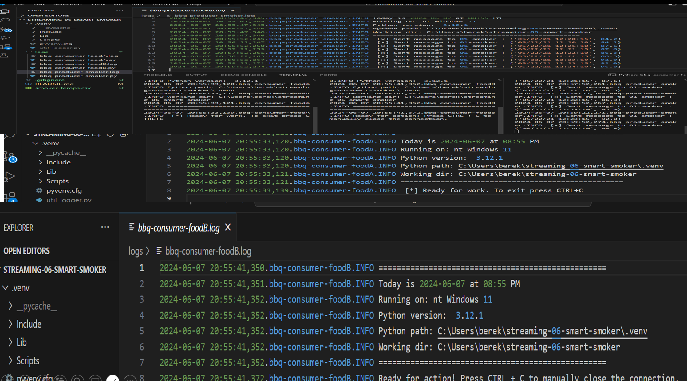

## streaming-06-smart-smoker
## Author: Hanna Anenia
## Date: 6/5/2024
## Objective:
Use RabbitMQ to distribute tasks to multiple workers

One process will create task messages. Multiple worker processes will share the work.

## Prerequisites
RabbitMQ Installed and running on your machine Pika installed and running on Python

The Problem / Challenge To Solve Read about the Smart Smoker system. Access the smoker data file here Download smoker data file here.

smoker-temps.csv has 4 columns:
[0] Time = Date-time stamp for the sensor reading [1] Channel1 = Smoker Temp --> send to message queue "01-smoker" [2] Channel2 = Food A Temp --> send to message queue "02-food-A" [3] Channel3 = Food B Temp --> send to message queue "03-food-B"

## Task 1. Create a Place to Work
In GitHub, create a new repo for your project - name it streaming-05-smart-smoker Add a README.md during the creation process. Clone your repo down to your machine. In VS Code, add a .gitignore, start working on the README.md. Add the csv data (smoker-temps.csv) file to your repo. Create a file for your bbq producer.

## Task 2. Design and Implement Your Producer
Implement your bbq producer. Used the logic, approach, and structure from Module 4, version 2 and version 3. comments added in the code and repo to explain your work. Use docstring comments and add your name and date to your README and your code files.
Smart Smoker System
Read about the Smart Smoker system here: Smart Smoker
We read one value every half minute. (sleep_secs = 30)
smoker-temps.csv has 4 columns:

[0] Time = Date-time stamp for the sensor reading
[1] Channel1 = Smoker Temp --> send to message queue "01-smoker"
[2] Channe2 = Food A Temp --> send to message queue "02-food-A"
[3] Channe3 = Food B Temp --> send to message queue "02-food-B"
We want know if:

The smoker temperature decreases by more than 15 degrees F in 2.5 minutes (smoker alert!)
Any food temperature changes less than 1 degree F in 10 minutes (food stall!)
Time Windows

Smoker time window is 2.5 minutes
Food time window is 10 minutes
Deque Max Length

At one reading every 1/2 minute, the smoker deque max length is 5 (2.5 min * 1 reading/0.5 min)
At one reading every 1/2 minute, the food deque max length is 20 (10 min * 1 reading/0.5 min) 
Condition To monitor

If smoker temp decreases by 15 F or more in 2.5 min (or 5 readings)  --> smoker alert!
If food temp change in temp is 1 F or less in 10 min (or 20 readings)  --> food stall alert!
Requirements

RabbitMQ server running
pika installed in your active environment

## Screenshot

